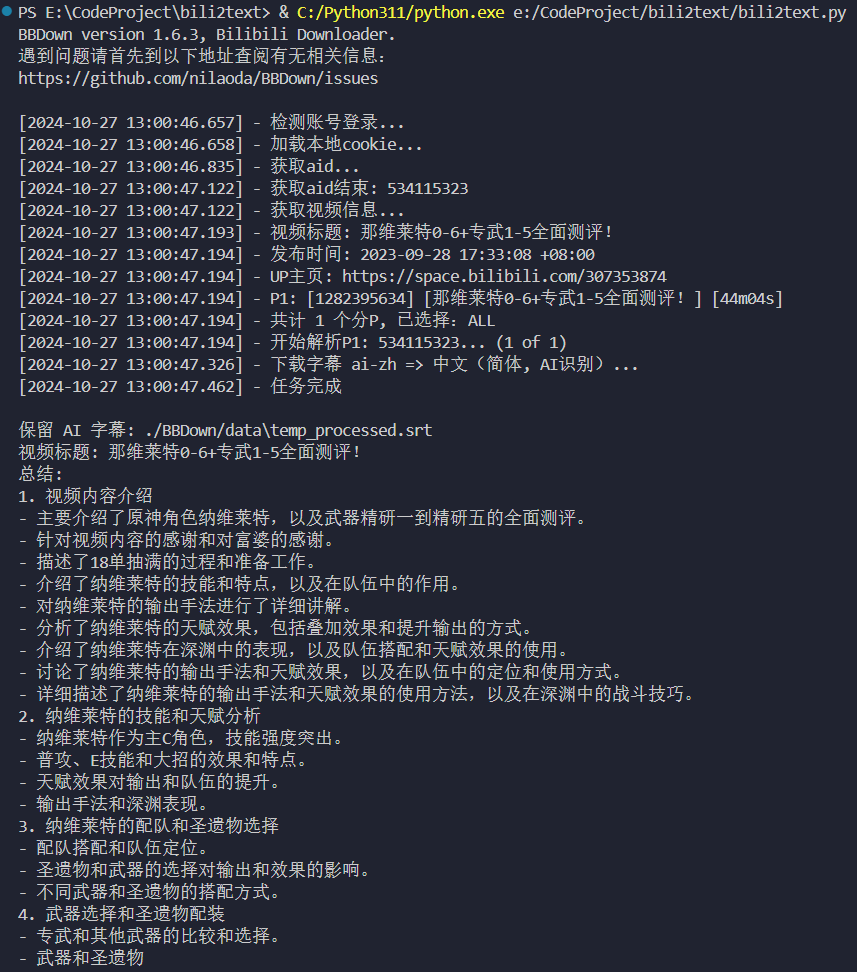

# Bili2Text
输入B站视频链接，自动提取字幕并将其提交至GPT进行总结

字幕文件获取:基于BBDown进行视频的字幕获取(项目地址:https://github.com/nilaoda/BBDown)

使用方法:
确保下载了BBDown并将其放在bili2text.py文件所在的目录下
BBDown下载地址:https://github.com/nilaoda/BBDown/releases/

代码示例
```python
if __name__ == "__main__":
    print(bilibili_summary('https://www.bilibili.com/video/BV1vu411u7bM/')) # 测试用例
```

## 运行截图

